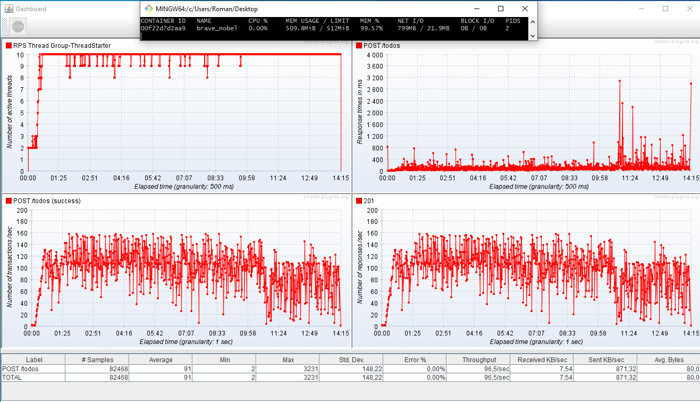

### Решение тестового задания

Запуск нагрузки (адрес сервиса захардкожен http://localhost:8080):
```declarative
./gradlew test
```
Контейнер для нагрузки был поднят с данными настройками:
```declarative
docker run -it -p 8080:4242 --memory="512m" --cpus="0.1" todo-app:latest
```
Нагружается метод POST /todos, следующим образом:
1) 0.5 рпс - 10 сек (пытался избавиться от спайка в начале, но не вышло)
2) Еще 30 сек до 150 рпс (больше в моем случае нет смысла, так как на виндовую виртуалку, где я делаю отладку, выделено 8гб оперативки и 2 процессора, с учетом того что докер запускается там же)

Результат:
1) При данной конфигурации оперативная память упирается в потолок (до 510 из 512) после ~65к запросов или ~10 минут со средним рпс ~150, при этом сервис не начинает возращать ошибки
2) Если в данном состатоянии вызвать GET /todos, то сервис с контейнером крашнется
3) Пики по времени ответа до того как заполнилась оперативка были до 1000мс, после до 3200мс, среднее время ответа при нагрузке до 10минут 65мс, а после среднее время ответа начинает повышаться до +90мс

